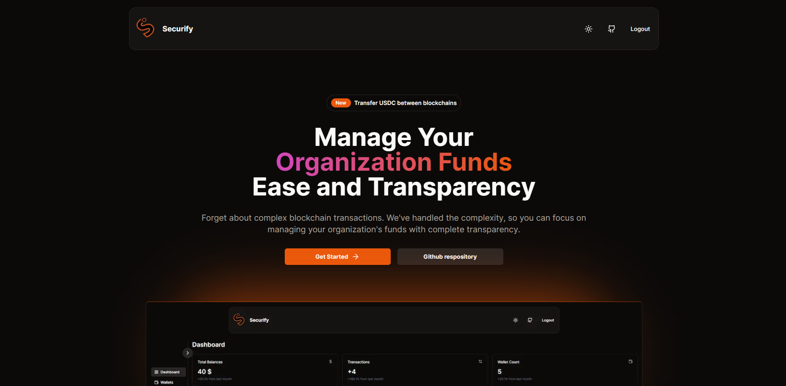
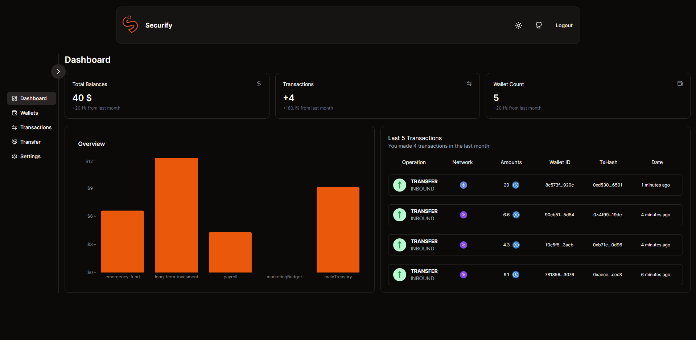

# SECURIFY

  
  

    Securify is an easy-to-use blockchain wallet designed for associations, companies and communities. You can create multiple wallets, group them and transfer USDC between different blockchains. All your transactions are recorded transparently on the blockchain.
  

[Demo Video](https://youtu.be/EvRU7OLqG3k?si=Cd2F2s9GlonH29u2)

## Tech Stack

| Frontend     | Backend     |
| ------------ | ----------- |
| Next.js      | MongoDB     |
| Tailwind CSS | web3.js     |
| shadcn       | Prisma      |
|              | TypeScript  |
|              | Alchemy     |
|              | NextAuth.js |

- **Circle:**
  - User Controlled Wallets
  - Developer Controlled Wallets
  - Gas Station
  - CCTP (Cross-Chain Transfer Protocol)

## Usage Scenarios

    
Technology company executives:

1. **Central Wallet:**

   - **Purpose:** Manages the company's main budget, stores large amounts of assets.
   - **Usage areas:**
     - Staff salary payments
     - Supplier payments
     - Tax payments
     - Investment decisions
     - Emergency funds
   - **Security:**
     - An additional layer of security is added with the multi-signature system (multi-sig).
     - With cold storage, large amounts of assets are stored offline.
     - Regular security audits and updates are performed.

2. **Project Wallets:**

   - **Purpose:** Budgets allocated for different projects are managed.
   - **Usage areas:**
     - R&D projects
     - Marketing campaigns
     - New product development
     - Collaborations
   - **Security:**
     - A separate wallet is created for each project.
     - Budget limits are determined and monitored regularly.

3. **Payment Wallet:**

   - **Purpose:** Used for daily transactions.
   - **Usage areas:**
     - Small payments
     - Operating expenses
   - **Security:**
     - Low limits are set.
     - Balance checks are made regularly.

4. **Investment Wallets:**
   - **Purpose:** Used for long-term investments.
   - **Usage areas:**
     - Other cryptocurrencies
     - DeFi protocols
     - NFTs
   - **Security:**
     - Separate wallets are created for different cryptocurrencies.
     - Investment decisions are reviewed regularly.

| Wallet Group          | Sample Wallet Names                                   | Description                                                                                             |
| --------------------- | ----------------------------------------------------- | ------------------------------------------------------------------------------------------------------- |
| **Main Wallet**       | Main Treasury, General Fund, Company Treasury         | Used for the company's main budget, large transactions, and long-term investments.                      |
| **Project Wallets**   | ProjectA, ProjectB, R&D Fund, Marketing Budget        | Separate budgets are created for each project. Expenses are made according to the needs of the project. |
| **Payment Wallet**    | Daily Expenses, Payroll, Supplier Payments            | Used for daily transactions, small payments, and recurring payments.                                    |
| **Investment Wallet** | Long-Term Investment, Crypto Assets, DeFi Investments | Used for cryptocurrencies, DeFi protocols, and other long-term investments.                             |
| **Backup Wallet**     | Backup Key, Emergency Fund                            | Used as a backup in case of system failures or security risks.                                          |

Non-Profit Organization

1. **Income:**

   - **Donations:**
     - Individual
     - Corporate
     - Foundation
     - Crowdfunding
   - **Project Income:**
     - EU Projects
     - Government Grants
     - Partnerships
   - **Other Income:**
     - Interest
     - Sales (e.g., secondhand goods)

2. **Expenses:**

   - **Staff Costs:**
     - Salaries
     - Benefits
     - Training
     - Travel
   - **Volunteer Costs:**
     - Insurance
     - Training
     - Meals
     - Accommodation
   - **Project Costs:**
     - Staff
     - Materials
     - Rent
     - Marketing
   - **General & Administrative:**
     - Rent
     - Utilities
     - Office Supplies
     - Technology
   - **Aid Materials:**
     - Food
     - Clothing
     - Shelter
     - Medical Supplies

3. **Geographic Allocation:**

   - **Local:**
     - Within the city or region
   - **National:**
     - Other cities or regions within the country
   - **International:**
     - Foreign countries

4. **Emergency Fund:**
   - **Emergency:**
     - For unforeseen expenses or disasters

## Showcase

